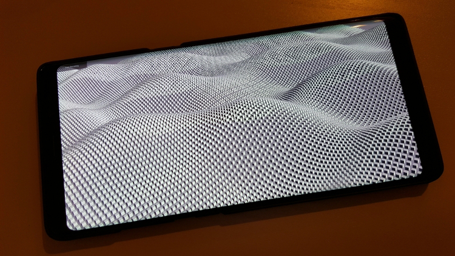
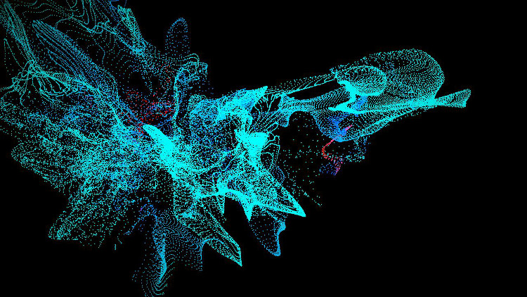
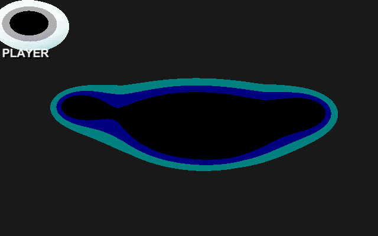

# Unity-GPGPU-Sandbox 
GPGPUを使った作品置き場です [English](https://translate.google.com/translate?sl=ja&tl=en&u=https://github.com/setchi/Unity-GPGPU-Sandbox) (by Google Translate)

## CubeWave
10万個のキューブによる波です。

## VertexParticle
メッシュの頂点によるパーティクルです。画面をクリックすると出ます。
フラグメントシェーダでレンダーテクスチャに位置情報を書き込み、頂点シェーダーで位置情報を取り出して頂点を動かしています。

## WIP: MetaballsGame
メタボールの当たり判定を使ったゲームを作りたい。

白っぽいプレイヤーがマウスで操作できます。敵に近づくにつれて色が補間されるのと、黒い部分がくっつくとアウト（赤くなる）という感じです。今はフラグメントシェーダ内で完結しているので、ゲームにするには判定処理を工夫する必要がありそうです。

## 開発環境
Unity 2017.3.0f3

## LICENSE
MIT
