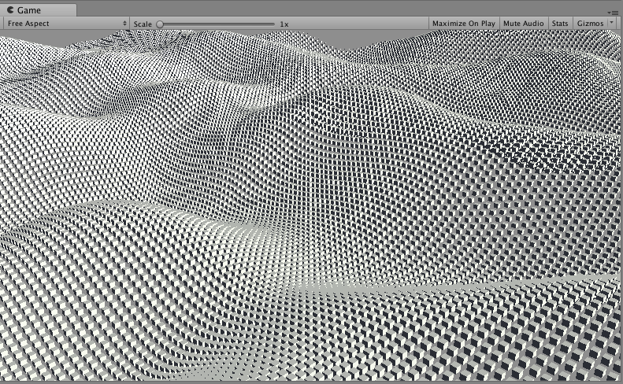

# Unity-GPGPU-Sandbox 
GPGPUを使った作品置き場です [English](https://translate.google.com/translate?sl=ja&tl=en&u=https://github.com/setchi/Unity-GPGPU-Sandbox) (by Google Translate)

## CubeWave
10万個のキューブによる波です

## 開発環境
Unity 2017.2.0f3

## LICENSE
MIT
